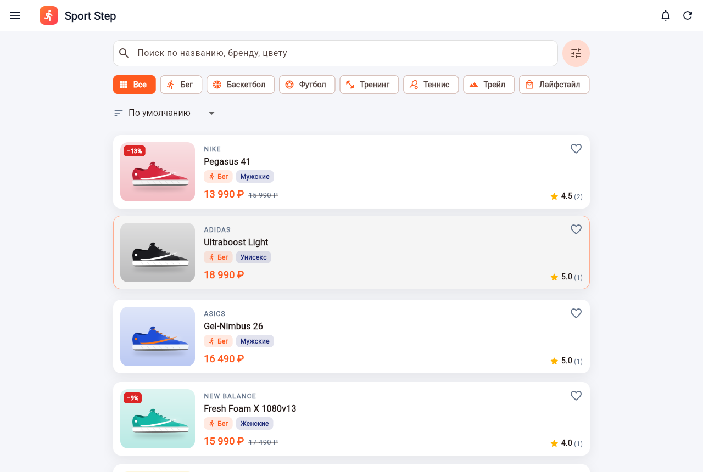

# Sport Step — веб-приложение «Каталог спортивной обуви»

Курсовая работа по дисциплине «Основы разработки кросс-платформенных приложений на языке высокого уровня».

* **Клиент (фронтенд)** — Flutter 3 / Dart (платформа: Web; проект собирается также под Windows и Android).
* **Сервер (бэкенд)** — Go, стандартная библиотека `net/http`, REST API в формате JSON.
* **База данных** — SQLite (файл `backend/shoes.db`, создаётся и заполняется автоматически при первом запуске).



## Быстрый запуск

Нужно установить: [Go 1.22+](https://go.dev/dl/) и [Flutter 3.35+](https://docs.flutter.dev/get-started/install) (с Dart 3.9+).

**Вариант 1 — одной командой (сервер раздаёт и API, и сайт):**

```bash
cd frontend
flutter pub get
flutter build web --no-web-resources-cdn
cd ../backend
go run .
```

Открыть в браузере: **http://localhost:8080**

**Вариант 2 — режим разработки (горячая перезагрузка Flutter):**

```bash
# терминал 1
cd backend
go run .

# терминал 2
cd frontend
flutter pub get
flutter run -d chrome
```

Адрес сервера можно поменять: `flutter run -d chrome --dart-define=API_URL=http://192.168.1.10:8080`.
Параметры сервера: `go run . -addr :8080 -db shoes.db -web ../frontend/build/web`.
Чтобы вернуть базу к исходному состоянию, остановите сервер и удалите файл `backend/shoes.db`.

## Тестовые учётные записи

| Роль | Логин | Пароль |
|---|---|---|
| Администратор | `admin` | `admin123` |
| Клиент | `client` | `client123` |
| Клиент | `anna` | `anna123` |
| Клиент | `sergey` | `sergey123` |

Роль при входе **не выбирается** — сервер сам определяет, кто вошёл, и приложение показывает соответствующий интерфейс. Новые пользователи регистрируются как клиенты.

## Соответствие требованиям ТЗ

| Требование | Где реализовано |
|---|---|
| **Удовлетворительно** | |
| Список через `ListView.builder`, ≥ 20 строк | `widgets/paged_shoe_list.dart`, в каталоге 40 моделей |
| Открытие элемента с подробной информацией и фото | `screens/shoe_detail_screen.dart` |
| Редактирование, сохранение, добавление нового | `screens/shoe_form_screen.dart` (администратор) |
| Метод работы с API | `services/api_service.dart` → REST API на Go |
| Меню (AppBar / Drawer) | `widgets/app_drawer.dart` + действия в AppBar |
| Селекторы (≥ 2 видов) | RadioListTile, CheckboxListTile, Switch, RangeSlider, DropdownButton, SegmentedButton, ChoiceChip, FilterChip |
| **Хорошо** | |
| Стили в отдельном классе через переменные | `styles/app_styles.dart` (`AppColors`, `AppStyles`, `ShoeCategories`) |
| Хранение данных | SQLite на сервере + SharedPreferences (токен, тема, история поиска) |
| Доп. опция: удаление/корзина + избранное | Корзина с восстановлением (`trash_screen.dart`), избранное (`favorites_screen.dart`) |
| **Отлично** | |
| ≥ 2 пользователей | Клиент и администратор |
| Сохранение изменений пользователей | Избранное, отзывы, заявки клиента; список заблокированных у администратора — в БД |
| Анимация загрузки | `widgets/loading.dart`: «прыгающий» кроссовок, shimmer-скелетоны |
| Вывод по 5 элементов (прокрутка или кнопка) | `PagedShoeList`: подгрузка при прокрутке **и** кнопка «Показать ещё» |
| **Работа в паре** | |
| 40 строк данных | `backend/seed.go` — 40 моделей |
| Приветственное окно с анимацией | `screens/splash_screen.dart` |
| Вход без выбора роли | Роль возвращает сервер (`POST /api/auth/login`) |
| Кнопка уведомлений | `widgets/notification_bell.dart`: у администратора — счётчик новых заявок, колокольчик мигает и покачивается; по нажатию открываются заявки. Клиент аналогично получает ответ на свою заявку |

## Структура проекта

```
Kursach/
├── backend/                  серверная часть (Go)
│   ├── main.go               запуск HTTP-сервера, CORS, раздача статики
│   ├── routes.go             таблица маршрутов REST API
│   ├── db.go                 схема БД SQLite и начальное заполнение
│   ├── seed.go               40 моделей обуви и стартовые отзывы
│   ├── models.go             структуры данных (User, Shoe, Review, Order)
│   ├── auth.go               регистрация, вход, сессии, middleware ролей
│   ├── shoes.go              каталог: фильтры, сортировка, пагинация, CRUD, корзина
│   ├── social.go             избранное, отзывы, пользователи, статистика
│   ├── orders.go             заявки на бронирование и уведомления
│   ├── util.go               JSON-ответы и обработка ошибок
│   ├── api_test.go           автотесты API (go test ./...)
│   ├── static/images/        изображения моделей
│   └── tools/gen_images.py   генератор иллюстраций
├── frontend/                 клиентская часть (Flutter)
│   └── lib/
│       ├── main.dart         точка входа, провайдеры, AuthGate
│       ├── config.dart       адрес сервера, размер страницы
│       ├── models/           Shoe, ShoeFilter, User, Order, Review
│       ├── services/         ApiService (HTTP), StorageService (SharedPreferences)
│       ├── providers/        AuthProvider, NotificationProvider, ThemeProvider
│       ├── styles/           AppColors, AppStyles, темы
│       ├── screens/          экраны приложения
│       └── widgets/          переиспользуемые виджеты
└── docs/                     материалы для отчёта
    ├── REPORT.md             заготовки разделов пояснительной записки
    ├── diagrams/             диаграммы классов, развёртывания, БД (PlantUML + PNG)
    └── screenshots/          скриншоты экранов
```

Проверки: `cd backend && go test ./...`, `cd frontend && flutter analyze`.
